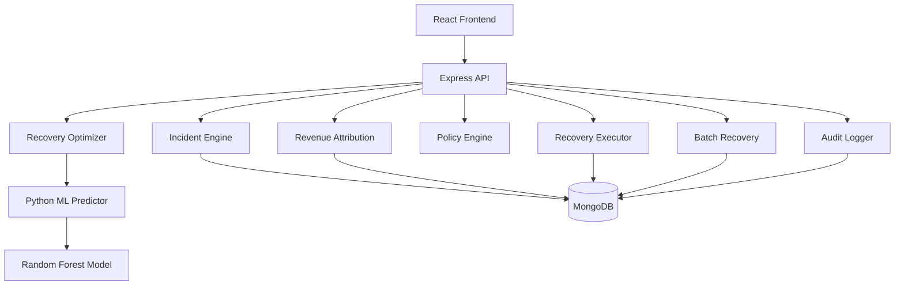
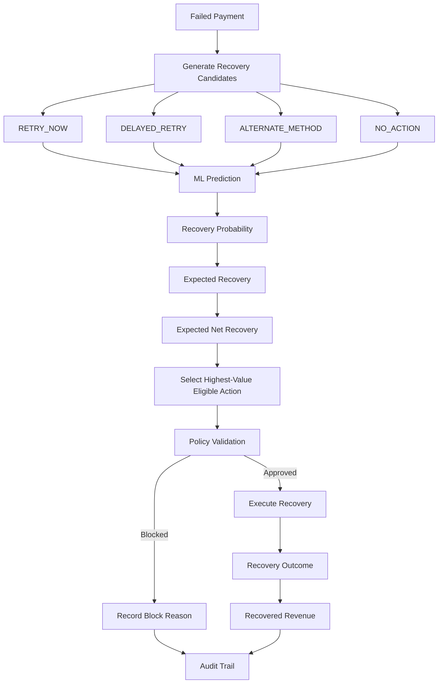
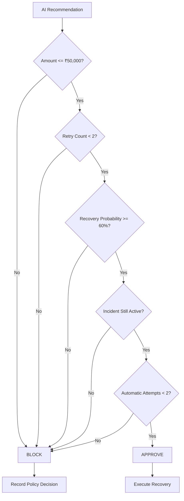
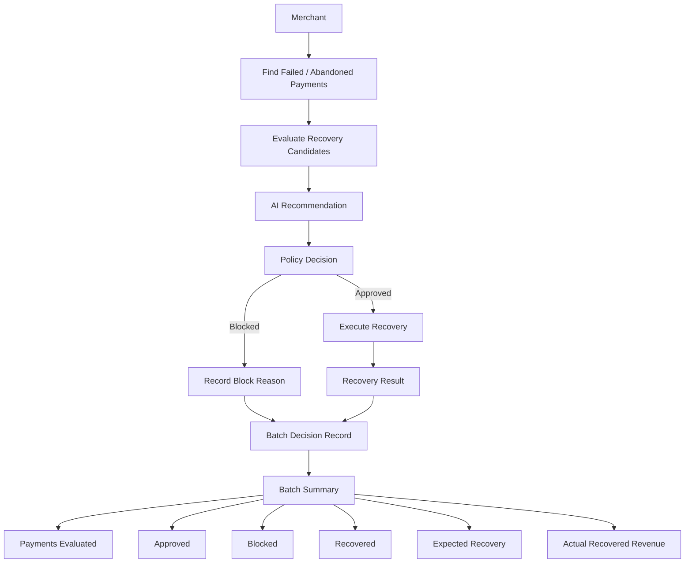

# AI Revenue Recovery

> An AI-powered revenue recovery orchestration system for detecting revenue at risk, selecting the right recovery intervention, enforcing safety policies, executing approved actions, and measuring recovered revenue.

## Overview

Revenue loss rarely happens in a single step.

A payment fails, a payment method experiences degradation, or repeated retries stop being effective. The challenge is not simply detecting the failure — it is deciding **what should happen next, whether it is safe to act, and whether the intervention actually recovered revenue**.

AI Revenue Recovery acts as an intelligence and orchestration layer around failed payment recovery.

It evaluates recovery opportunities, compares possible interventions using machine-learning predictions, applies bounded recovery policies, executes approved actions, and records the complete decision and outcome.

---

## The Problem

Traditional recovery systems can rely heavily on fixed retry rules.

This creates several problems:

- Not every failed payment should be retried immediately.
- Different recovery actions can have different success probabilities.
- Repeated retries can waste recovery attempts.
- High-value transactions may require stricter controls.
- A recommendation without an outcome does not show whether revenue was actually recovered.

The system therefore treats recovery as a **decision and optimization problem**, rather than simply a retry operation.

---

## The Solution

For every recovery opportunity, the system moves through a structured workflow:


The system connects:

**Detection → Prediction → Optimization → Policy → Execution → Measurement → Audit**

---

# System Architecture



---

# AI Recovery Workflow

Each failed payment can be evaluated against multiple recovery strategies.



### Recovery strategies

| Action | Description |
|---|---|
| `RETRY_NOW` | Attempt recovery immediately |
| `DELAYED_RETRY` | Attempt recovery using a delayed retry strategy |
| `ALTERNATE_METHOD` | Attempt recovery through an alternative payment method |
| `NO_ACTION` | Do not perform automated recovery |

---

# Recovery Optimization

The optimizer compares candidate recovery strategies using the ML-generated probability of successful recovery.

### Expected Recovery

```text
Expected Recovery
= Payment Amount × Recovery Probability
```

### Expected Net Recovery

```text
Expected Net Recovery
= Expected Recovery − Action Cost
```

The system selects the highest expected net recovery among actions that satisfy the minimum confidence threshold.

This allows the system to distinguish between:

```text
"Can this payment potentially be recovered?"
```

and:

```text
"Which recovery action creates the best expected outcome?"
```

---

# Recovery Policy

AI recommendations are not executed automatically without validation.

The policy engine evaluates hard recovery constraints before execution.



### Current policy controls

| Control | Value |
|---|---:|
| Maximum automatic recovery amount | ₹50,000 |
| Minimum recovery probability | 60% |
| Maximum retries | 2 |
| Maximum automatic attempts | 2 |

These controls prevent unlimited or low-confidence automated recovery.

---

# Recovery Execution

Once an action is approved, the executor performs the bounded recovery workflow.

The execution layer verifies that:

- the payment exists,
- the payment is currently recoverable,
- automatic recovery attempts have not been exhausted,
- the selected action is valid.

The resulting outcome is recorded as either a recovered payment or a failed recovery attempt.

> **Prototype note:** recovery execution is simulated to demonstrate the complete decision → policy → execution → measurement workflow.

---

# Batch Recovery

The system can evaluate multiple failed payments for a merchant in a single workflow.



The batch results provide an individual decision and outcome for each payment.

### Batch information includes

- Payment ID
- Payment amount
- AI-selected action
- Recovery probability
- Expected recovery
- Expected net recovery
- Policy decision
- Policy reasons
- Execution status
- Recovered amount

---

# Revenue Recovery Metrics

The dashboard tracks the financial outcome of recovery workflows.

Key metrics include:

- Revenue at risk
- Recoverable revenue
- Expected recovery
- Actual recovered revenue
- Recovery count
- Recovery rate
- Recovery performance by action
- Approved recovery actions
- Blocked recovery actions

The distinction between expected and actual recovery is intentional.

For example:

```text
Expected Recovery
= ₹36,300

Actual Recovery
= ₹44,068
```

Expected recovery represents the model's estimated value before execution.

Actual recovery represents the outcome after execution.

---

# Audit Trail

Every recovery workflow produces an auditable sequence:


The audit trail records important decision context such as:

- Payment ID
- AI-selected action
- Recovery probability
- Policy decision
- Policy reasons
- Retry / recovery attempt
- Execution result
- Amount recovered
- Timestamp

This allows a recovery decision to be traced from recommendation to final outcome.

---

# Machine Learning

The recovery prediction model is implemented in Python using a Random Forest classifier.

### Input features

The model considers:

- Payment amount
- Payment method
- Bank
- Device
- Failure reason
- Previous success rate
- Previous failures
- Customer age
- Recovery action

### Candidate actions

```text
RETRY_NOW
DELAYED_RETRY
ALTERNATE_METHOD
NO_ACTION
```

The model returns a recovery probability for a given payment and action combination.

The backend then uses those predictions during recovery optimization.

---

# Project Structure

```text
ai-revenue-recovery/
│
├── backend/
│   ├── config/
│   │   └── db.js
│   │
│   ├── models/
│   │   ├── AuditLog.js
│   │   ├── Incident.js
│   │   ├── Merchant.js
│   │   ├── PaymentEvent.js
│   │   └── RecoveryAction.js
│   │
│   ├── routes/
│   │   └── incidentRoutes.js
│   │
│   ├── services/
│   │   ├── auditLogger.js
│   │   ├── batchRecovery.js
│   │   ├── incidentEngine.js
│   │   ├── merchantIntelligence.js
│   │   ├── recoveryExecutor.js
│   │   ├── recoveryOptimizer.js
│   │   ├── recoveryPolicy.js
│   │   ├── recoveryPredictor.js
│   │   ├── recoveryWorkflow.js
│   │   └── revenueAttribution.js
│   │
│   ├── utils/
│   │   ├── incidentSimulator.js
│   │   └── seedData.js
│   │
│   ├── server.js
│   ├── seed.js
│   └── clearIncidents.js
│
├── frontend/
│   ├── src/
│   │   ├── App.tsx
│   │   ├── main.tsx
│   │   ├── style.css
│   │   ├── audit-trail.css
│   │   └── batch-results.css
│   │
│   ├── public/
│   └── package.json
│
├── ml/
│   ├── data/
│   │   ├── generate_training_data.py
│   │   └── recovery_training.csv
│   │
│   ├── models/
│   │   └── recovery_model.joblib
│   │
│   ├── predict.py
│   └── train_model.py
│
├── .gitignore
└── README.md
```

---

# Technology Stack

### Frontend

- React
- TypeScript
- Vite
- Lucide React

### Backend

- Node.js
- Express
- MongoDB
- Mongoose

### Machine Learning

- Python
- Scikit-learn
- Random Forest
- Joblib

---

# Running Locally

## 1. Clone the repository

```bash
git clone https://github.com/harshit180704/ai-revenue-recovery.git
cd ai-revenue-recovery
```

## 2. Configure MongoDB

Create:

```text
backend/.env
```

Example:

```env
PORT=5000
MONGO_URI=your_mongodb_connection_string
```

Do not commit the real `.env` file.

## 3. Install backend dependencies

```bash
cd backend
npm install
```

## 4. Start the backend

```bash
npm start
```

## 5. Install frontend dependencies

Open another terminal:

```bash
cd frontend
npm install
```

## 6. Start the frontend

```bash
npm run dev
```

Open the local Vite URL shown in the terminal.

---

# Demo Flow

A recommended demonstration sequence:

```text
Dashboard
   ↓
Incidents
   ↓
AI Recovery Center
   ↓
Select Failed Payment
   ↓
Generate AI Recommendation
   ↓
Review Expected Recovery
   ↓
Policy Check
   ↓
Execute Recovery
   ↓
View Recovered Revenue
   ↓
Run Batch Recovery
   ↓
Review Batch Decisions
   ↓
Audit Trail
```

---

# Key Design Principle

The system is designed around a simple idea:

```text
Detect
  ↓
Predict
  ↓
Optimize
  ↓
Control
  ↓
Execute
  ↓
Measure
  ↓
Audit
```

The objective is not to retry every failed transaction.

The objective is to make **bounded, explainable, value-driven recovery decisions** and measure what happens after those decisions are executed.

---

